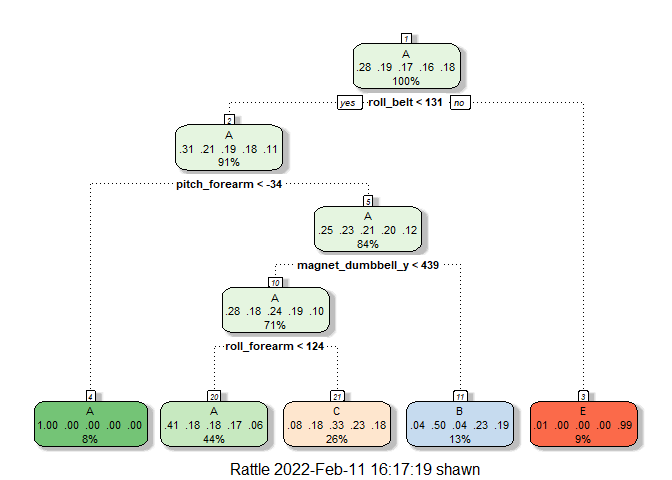
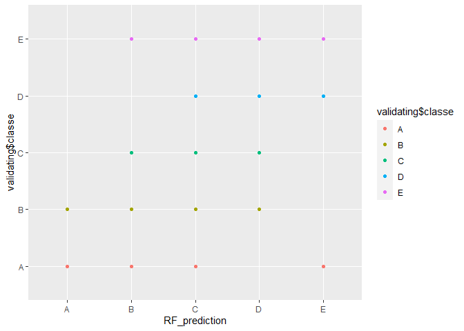

## Introduction
Using devices such as Jawbone Up, Nike FuelBand, and Fitbit it is now possible to collect a large amount of data about personal activity relatively inexpensively. These type of devices are part of the quantified self movement – a group of enthusiasts who take measurements about themselves regularly to improve their health, to find patterns in their behavior, or because they are tech geeks. One thing that people regularly do is quantify how much of a particular activity they do, but they rarely quantify how well they do it. In this project, your goal will be to use data from accelerometers on the belt, forearm, arm, and dumbell of 6 participants. They were asked to perform barbell lifts correctly and incorrectly in 5 different ways. More information is available from the website here: http://groupware.les.inf.puc-rio.br/har (see the section on the Weight Lifting Exercise Dataset). 

The training data for this project are available here: 

https://d396qusza40orc.cloudfront.net/predmachlearn/pml-training.csv

The test data are available here:

https://d396qusza40orc.cloudfront.net/predmachlearn/pml-testing.csv

```r
library(caret)
```

```
## Warning: package 'caret' was built under R version 4.1.2
```

```
## Loading required package: ggplot2
```

```
## Warning: package 'ggplot2' was built under R version 4.1.2
```

```
## Loading required package: lattice
```

```r
library(rpart)
```

```
## Warning: package 'rpart' was built under R version 4.1.2
```

```r
library(rpart.plot)
```

```
## Warning: package 'rpart.plot' was built under R version 4.1.2
```

```r
library(rattle)
```

```
## Warning: package 'rattle' was built under R version 4.1.2
```

```
## Loading required package: tibble
```

```
## Warning: package 'tibble' was built under R version 4.1.2
```

```
## Loading required package: bitops
```

```
## Rattle: A free graphical interface for data science with R.
## Version 5.4.0 Copyright (c) 2006-2020 Togaware Pty Ltd.
## Type 'rattle()' to shake, rattle, and roll your data.
```

```r
library(randomForest)
```

```
## Warning: package 'randomForest' was built under R version 4.1.2
```

```
## randomForest 4.7-1
```

```
## Type rfNews() to see new features/changes/bug fixes.
```

```
## 
## Attaching package: 'randomForest'
```

```
## The following object is masked from 'package:rattle':
## 
##     importance
```

```
## The following object is masked from 'package:ggplot2':
## 
##     margin
```

```r
library(gbm)
```

```
## Warning: package 'gbm' was built under R version 4.1.2
```

```
## Loaded gbm 2.1.8
```
# Reading CSVs

```r
training_set<- read.csv("pml-training.csv")
testing_set<- read.csv("pml-testing.csv")
```
# Cleaning the Data

```r
nearZeroVar <- nearZeroVar(training_set)
train_data <- training_set[,-nearZeroVar]
test_data <- testing_set[,-nearZeroVar]
str(test_data)
```

```r
NaCols <- sapply(train_data, function(x) mean(is.na(x))) > 0.95
train_data <- train_data[,NaCols == FALSE]
test_data <- test_data[,NaCols == FALSE]
str(test_data)
```
# Removing the first 6 non-numeric variables

```r
train_data <- train_data[,7:59]
test_data <- test_data[,7:59]
str(test_data)
```
# Creating testing and a validation set 60/40 split

```r
inTrain<- createDataPartition(train_data$classe, p=0.6, list=FALSE)
training<- train_data[inTrain,]
validating<- train_data[-inTrain,]
dim(training)
```

```
## [1] 11776    53
```

```r
dim(validating)
```

```
## [1] 7846   53
```
# Runing a Decision Tree model

```r
DT_modelfit<- train(classe ~. , data=training, method= "rpart")
fancyRpartPlot(DT_modelfit$finalModel)
```

<!-- -->

```r
DT_prediction <- predict(DT_modelfit, validating)
confusionMatrix(as.factor(DT_prediction), as.factor(validating$classe))
```

```
## Confusion Matrix and Statistics
## 
##           Reference
## Prediction    A    B    C    D    E
##          A 2023  610  627  575  205
##          B   34  534   48  228  198
##          C  168  374  693  483  408
##          D    0    0    0    0    0
##          E    7    0    0    0  631
## 
## Overall Statistics
##                                           
##                Accuracy : 0.4946          
##                  95% CI : (0.4835, 0.5058)
##     No Information Rate : 0.2845          
##     P-Value [Acc > NIR] : < 2.2e-16       
##                                           
##                   Kappa : 0.34            
##                                           
##  Mcnemar's Test P-Value : NA              
## 
## Statistics by Class:
## 
##                      Class: A Class: B Class: C Class: D Class: E
## Sensitivity            0.9064  0.35178  0.50658   0.0000  0.43759
## Specificity            0.6407  0.91972  0.77879   1.0000  0.99891
## Pos Pred Value         0.5007  0.51248  0.32596      NaN  0.98903
## Neg Pred Value         0.9451  0.85538  0.88199   0.8361  0.88749
## Prevalence             0.2845  0.19347  0.17436   0.1639  0.18379
## Detection Rate         0.2578  0.06806  0.08833   0.0000  0.08042
## Detection Prevalence   0.5149  0.13281  0.27097   0.0000  0.08132
## Balanced Accuracy      0.7735  0.63575  0.64268   0.5000  0.71825
```
The Decision Tree Model has a low accuracy level

# Running a Random Forest Model

```r
RF_modelfit <- train(classe ~ ., data = training, method = "rf", ntree = 100)
RF_prediction<- predict(RF_modelfit, validating)
qplot(RF_prediction,validating$classe, colour=validating$classe)
```

<!-- -->

```r
RF_confusionMatrix<-confusionMatrix(as.factor(RF_prediction), as.factor(validating$classe))
RF_confusionMatrix
```

```
## Confusion Matrix and Statistics
## 
##           Reference
## Prediction    A    B    C    D    E
##          A 2229    9    0    0    0
##          B    1 1506    7    0    2
##          C    1    2 1355   18    6
##          D    0    1    6 1267    7
##          E    1    0    0    1 1427
## 
## Overall Statistics
##                                           
##                Accuracy : 0.9921          
##                  95% CI : (0.9899, 0.9939)
##     No Information Rate : 0.2845          
##     P-Value [Acc > NIR] : < 2.2e-16       
##                                           
##                   Kappa : 0.99            
##                                           
##  Mcnemar's Test P-Value : NA              
## 
## Statistics by Class:
## 
##                      Class: A Class: B Class: C Class: D Class: E
## Sensitivity            0.9987   0.9921   0.9905   0.9852   0.9896
## Specificity            0.9984   0.9984   0.9958   0.9979   0.9997
## Pos Pred Value         0.9960   0.9934   0.9805   0.9891   0.9986
## Neg Pred Value         0.9995   0.9981   0.9980   0.9971   0.9977
## Prevalence             0.2845   0.1935   0.1744   0.1639   0.1838
## Detection Rate         0.2841   0.1919   0.1727   0.1615   0.1819
## Detection Prevalence   0.2852   0.1932   0.1761   0.1633   0.1821
## Balanced Accuracy      0.9985   0.9953   0.9932   0.9915   0.9946
```
The Random Forest Model accuracy is 99%

# Running a Gradient Boosting Model

```r
gbm_modelfit<- train(classe~., data=training, method="gbm", verbose= FALSE)
gbm_prediction<- predict(gbm_modelfit, validating)
qplot(gbm_prediction,validating$classe, colour=validating$classe)
```

<!-- -->

```r
gbm_confusionMatrix<-confusionMatrix(as.factor(gbm_prediction), as.factor(validating$classe))
gbm_confusionMatrix
```

```
## Confusion Matrix and Statistics
## 
##           Reference
## Prediction    A    B    C    D    E
##          A 2207   49    0    2    2
##          B   12 1424   37    3   25
##          C    8   44 1311   44   13
##          D    4    0   17 1225   20
##          E    1    1    3   12 1382
## 
## Overall Statistics
##                                           
##                Accuracy : 0.9621          
##                  95% CI : (0.9577, 0.9663)
##     No Information Rate : 0.2845          
##     P-Value [Acc > NIR] : < 2.2e-16       
##                                           
##                   Kappa : 0.9521          
##                                           
##  Mcnemar's Test P-Value : 1.618e-12       
## 
## Statistics by Class:
## 
##                      Class: A Class: B Class: C Class: D Class: E
## Sensitivity            0.9888   0.9381   0.9583   0.9526   0.9584
## Specificity            0.9906   0.9878   0.9832   0.9938   0.9973
## Pos Pred Value         0.9765   0.9487   0.9232   0.9676   0.9878
## Neg Pred Value         0.9955   0.9852   0.9911   0.9907   0.9907
## Prevalence             0.2845   0.1935   0.1744   0.1639   0.1838
## Detection Rate         0.2813   0.1815   0.1671   0.1561   0.1761
## Detection Prevalence   0.2880   0.1913   0.1810   0.1614   0.1783
## Balanced Accuracy      0.9897   0.9630   0.9708   0.9732   0.9779
```
The Gradient Boosting Model accuracy is 96%

# Conclusion
The Random Forest model is more accurate than Gradient Boosting Model at ~ 99% accuracy.
Expected out-of-sample error = 1 - accuracy of cross-validation testing = 0.01

#Running The Random Forest model on the test data

```r
test_prediction<- predict(RF_modelfit, test_data)
test_prediction
```

```
##  [1] B A B A A E D B A A B C B A E E A B B B
## Levels: A B C D E
```


